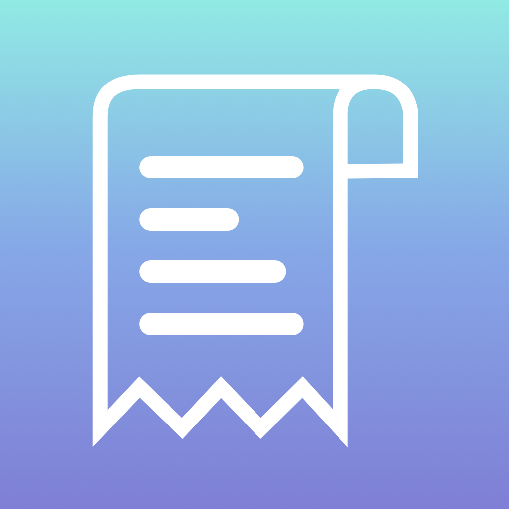

# Pre-work - *Tippy*

**Tippy** is a tip calculator application for iOS.

Submitted by: **Steven Camacho**

Time spent: **5** hours spent in total

## User Stories

The following **required** functionality is complete:

* [X] User can enter a bill amount, choose a tip percentage, and see the tip and total values.

The following **optional** features are implemented:
* [ ] Settings page to change the default tip percentage.
* [ ] UI animations
* [ ] Remembering the bill amount across app restarts (if <10mins)
* [ ] Using locale-specific currency and currency thousands separators.
* [ ] Making sure the keyboard is always visible and the bill amount is always the first responder. This way the user doesn't have to tap anywhere to use this app. Just launch the app and start typing.

The following **additional** features are implemented:
- [X] Added constraints to make app usable in iPhone 11, iPhone 11 Pro, iPhone 8, 7, 6 Plus, iPhone 8, 7, 6, iPhone SE (2nd generation)
- [X] Added a 'Number of People' Option where user can calculate how much bill is per person if bill is split among multiple people (from 1-10 people)
- [X] Added a high-quality app icon

## Video Walkthrough 

Here's a walkthrough of implemented user stories:

GIF created with [Recordit] (https://recordit.co).

## Notes

The main challenge was getting the UI of the app to be compatible in more than just my iPhone XR. Having your design stay consistent throughout the various sizes is difficult because of the different aspect ratios. I learned the basic concepts on constraints and how to make them auto layout the UI. Having background in programming in any environments and languages, the coding part of the app was very simple for me. 

Overall, I enjoyed designing this app from scratch and helped me learn some of the basics of IOS development proactively rather than just watching a video without making anything. I believe I am perfect for this course because I want to create apps through freelancing and for local businesses. This course teaches you by developing many applications, which isn't very common and I love that form. 

